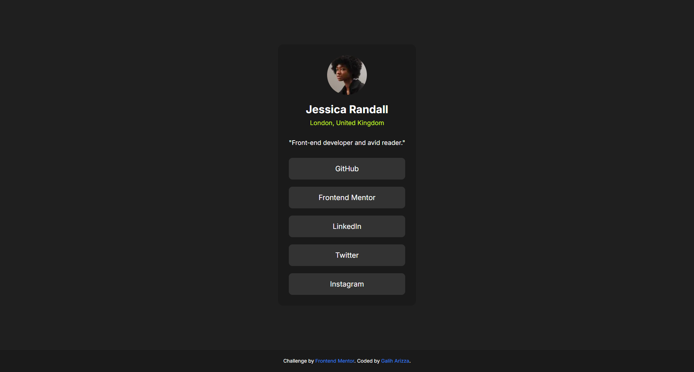

# Frontend Mentor - Social links profile solution

This is a solution to the [Social links profile challenge on Frontend Mentor](https://www.frontendmentor.io/challenges/social-links-profile-UG32l9m6dQ). Frontend Mentor challenges help you improve your coding skills by building realistic projects.

## Table of contents

- [Overview](#overview)
  - [The challenge](#the-challenge)
  - [Screenshot](#screenshot)
  - [Links](#links)
- [My process](#my-process)
  - [Built with](#built-with)
  - [What I learned](#what-i-learned)
  - [Continued development](#continued-development)
  - [Useful resources](#useful-resources)
- [Author](#author)

## Overview

### The challenge

Users should be able to:

- See hover and focus states for all interactive elements on the page

### Screenshot



### Links

- Solution URL: [https://github.com/chadittya/social-links-profile-main]
- Live Site URL: [https://social-links-profile-main-sjlm.vercel.app/]

## My process

### Built with

- Semantic HTML5 markup
- CSS custom properties
- Flexbox
- Mobile-first workflow
- [React](https://reactjs.org/) - JS library
- [Next.js](https://nextjs.org/) - React framework
- [Tailwind CSS](https://tailwindcss.com/) - For styles

### What I learned

In this project, I learned how to:

- Implement a responsive design using Tailwind CSS
- Create reusable components in React
- Use Next.js for server-side rendering and optimized performance
- Implement hover and focus states for interactive elements

Here's an example of a reusable component I created:

- [SocialLink.tsx](./app/components/SocialLink.tsx)

### Continued development

In future projects, I want to focus on:

- Improving accessibility features
- Implementing more complex state management
- Exploring advanced Next.js features

### Useful resources

- [Next.js Documentation](https://nextjs.org/docs) - This helped me understand the basics of Next.js and its features.
- [Tailwind CSS Documentation](https://tailwindcss.com/docs) - An excellent resource for learning how to use Tailwind CSS effectively.

## Author

- Website - [Galih Arizza]
- Frontend Mentor - [@yourusername](https://www.frontendmentor.io/profile/yourusername)

## Getting Started

First, run the development server:

```bash
npm run dev
or
yarn dev
or
pnpm dev
or
bun dev
```

Open [http://localhost:3000](http://localhost:3000) with your browser to see the result.

You can start editing the page by modifying `app/page.tsx`. The page auto-updates as you edit the file.

This project uses next/font to automatically optimize and load Inter, a custom Google Font, and Material Icons.
